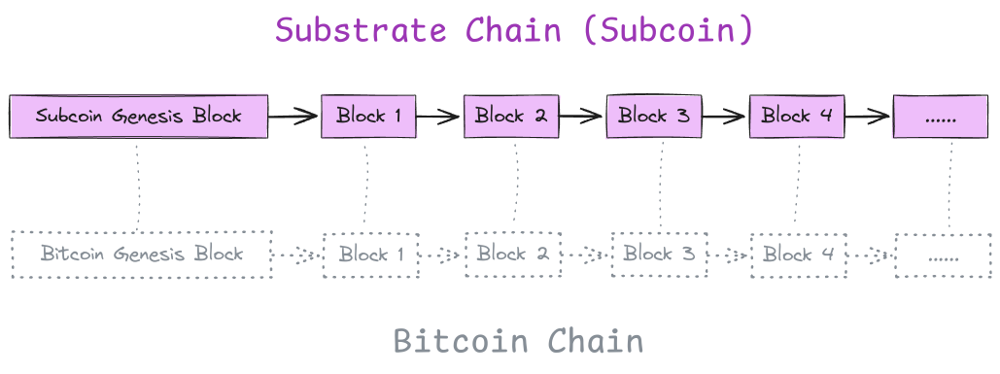

<!-- truncate -->

## Motivation

Bitcoin's full nodes play a vital role in maintaining the network's security and decentralization. However, as the Bitcoin blockchain grows, syncing to the network's tip has become increasingly challenging, especially for new nodes. This process demands significant bandwidth and storage, which can be prohibitive in regions with limited access to high-speed internet and large storage solutions.

Syncing Bitcoin from genesis is notoriously difficult. Existing Bitcoin software, such as Bitcoin Core, requires downloading and verifying every piece of data from the blockchain's inception in January 2009 to the present day. While Bitcoin Core offers a fast sync option, it relies on a trust assumption. Typically, fast sync involves downloading a state snapshot at a specific block and applying it directly to the database, bypassing the need to replay all historical transactions. However, this method requires downloading the snapshot from an external server and manually verifying it, as detailed in [BTC Pay Server's fast sync documentation](https://docs.btcpayserver.org/Docker/fastsync/). This approach compromises decentralization by depending on the trust of the snapshot provider.

## Solution

Subcoin introduces a decentralized fast sync mechanism to the Bitcoin network, enabling new nodes to quickly sync to the latest state without compromising trustlessness. Fast sync, also known as state sync, is a common concept in modern blockchain protocols, particularly in account-based systems with smart contracts, where the chain state can become too large to sync from genesis efficiently. For example, reprocessing all transactions from the genesis block on Ethereum can take weeks, making the full sync infeasible, thus necessitating fast/snap sync for most users.

Subcoin's core concept is straightforward: it embeds the Bitcoin chain within a Substrate chain, leveraging the existing state sync strategy provided by the Substrate framework to download the Bitcoin state efficiently. This integration allows users to synchronize to the latest Bitcoin state rapidly and in a decentralized manner, requiring no changes to the Bitcoin protocol itself. This innovation makes the Bitcoin network more accessible and efficient for new participants, regardless of their technical resources.

:::note

_Subcoin is not a new blockchain but a derived chain of Bitcoin, architecturally similar to how Layer 2 is derived from Layer 1 in the modular blockchain design. The difference is that Subcoin does not have its own state but is a pure replica of the Bitcoin chain._

:::

## Related work

### Subcoin VS Utreexo

[Utreexo](https://github.com/utreexo/utreexo) leverages the same technique as Subcoin at a high level, using the Merkle tree as the cryptographic accumulator for the state. The distinction is that Utreexo uses a more specialized data structure aimed at optimizing the storage and processing of Bitcoin's UTXOs. In contrast, Subcoin directly applies a state trie, commonly used by chains with a global state, on top of the Bitcoin state. Utreexo offers more specialized optimizations, while Subcoin benefits from the extensive, reusable infrastructures provided by the Substrate framework.

### Subcoin VS ZeroSync

[ZeroSync](https://github.com/ZeroSync/ZeroSync) uses STARK proof, which is extremely efficient and can verify the Bitcoin state instantly. The state proof produced by ZeroSync relies on Utreexo to augment the chain with a UTXO set commitment. In the future, Subcoin could serve as an additional Bitcoin state commitment provider for ZeroSync.

## Technical Overview

### Rationale For Using Substrate

Substrate ([polkadot-sdk](https://github.com/paritytech/polkadot-sdk)) is ideal for implementing a blockchain protocol without starting from scratch. As a leading blockchain development framework, Substrate is supported by a dedicated team with extensive experience in building production-grade blockchain software. Subcoin will continuously benefit from new features and updates within the Substrate ecosystem. Additionally, there have been many attempts to write a Rust Bitcoin client, but most have failed. Using Substrate is practical for implementing a sustainable blockchain protocol, especially for small teams and individuals, given the challenges of writing a Rust Bitcoin client from scratch.

### Subcoin Overview

Subcoin introduces an innovative approach to encapsulating the Bitcoin chain with the Substrate framework, effectively creating a new Substrate chain by embedding Bitcoin blocks within Substrate blocks. This integration is achieved by wrapping each Bitcoin block into a corresponding Substrate block, resulting in the Subcoin chain.

**Subcoin runtime**

Subcoin runtime is a minimalistic Substrate runtime,  comprising two essential pallets:

- **frame-system**: This pallet is the core component of the Substrate framework.
- **pallet-bitcoin**: This pallet tracks the state of the UTXO set on-chain. It processes the inputs and outputs of each Bitcoin transaction embedded in an unsigned extrinsic within the pallet.

**Subcoin Block Structure**

The Bitcoin header is embedded in the Substrate block header as a digest item. Each Bitcoin transaction is converted into an unsigned extrinsic in the pallet-bitcoin. This process effectively maps each Bitcoin block to a corresponding Subcoin block at the same height.

### Fast Sync

To enable fast sync for new Subcoin nodes, the network relies on a few Subcoin bootstrap nodes that have completed a Bitcoin full sync by downloading all blocks from the Bitcoin P2P network. Once these bootstrap nodes are set up, new Subcoin nodes can perform a fast sync by downloading the latest state of Bitcoin directly from the bootstrap nodes. This fast sync method significantly reduces the time and resources required compared to the full sync from the Bitcoin network.

:::info

A Subcoin bootstrap node must currently be either an archive node or a pruned node with an extensive pruning history. Once Substrate supports changing the pruning mode (see [this issue](https://github.com/paritytech/polkadot-sdk/issues/4671)), users can perform a fast sync to catch up with the latest Bitcoin state quickly and then transition to a partial archive node to serve as a bootstrap node.

:::

### Performance Analysis

**Archive Node**

An archive node means the entire state history will be preserved, which requires significant disk space. The local experiment indicates that a subcoin archive node may consume up to 3TB storage when synced to the tip, given that 1.9TB is already used at the height 583069. However, the archive node experiment was discontinued due to the lack of a larger SSD for testing.

**Initial Full Sync**

Although the initial full sync (or Initial Block Download) from the Bitcoin peer-to-peer network is super quick for the first 200,000 blocks, the block execution becomes increasingly slower beyond that point. Executing each subcoin block may take up to 1 second when syncing blocks after the height of 300,000 due to the heavy state root computation, which is elaborated later in [Optimize Bitcoin Execution Performance During Initial Full Sync](#next-steps). Therefore, finishing the initial full sync of subcoin from the Bitcoin P2P network currently may take several days, perhaps even over one week.

**Fast Sync**

Fast sync involves downloading both the header chain and a state snapshot at a specific height.

Each Bitcoin header is 80 bytes, while the corresponding Substrate header introduces additional overhead, bringing it to over 200 bytes. As a result, Subcoin requires over 100 MiB of data to download the header chain — an amount that is minimal compared to the gigabytes needed for the state download.

As of this writing, the Bitcoin state is approximately 12 GiB. The Subcoin state, which includes the entire list of key-value pairs in Subcoin's storage, is even larger mostly due to the storage prefix overhead. However, with the application of compression techniques (as detailed in https://github.com/polkadot-fellows/RFCs/pull/112), the data transfer during Subcoin's state sync is expected to be comparable to or even smaller than the state size in Bitcoin Core by comparing the state download size at early heights. This makes the Subcoin state snapshot more efficient for downloading. Precise figures will be available once the PoC implementation limitations discussed below are resolved.

**PoC Implementation Limitation**

The initial implementation of Subcoin has faced challenges due to limitations within the Substrate framework when dealing with large states. The latest Bitcoin state exceeds 12GiB, which is significantly larger than any known Substate-based chains. As a result, the current PoC implementation can only perform a fast sync up to a certain point in the middle of the Bitcoin network, where the chain state is smaller. Beyond this point, the node may encounter known issues related to state sync, as outlined in https://github.com/paritytech/polkadot-sdk/issues/5053. Other underlying factors may also contribute to the difficulties with fast sync.

Specifically, importing such a massive state requires substantial RAM. For instance, syncing around block height 580,000 may consume up to 128 GiB of memory, which is unsustainable given that there are still over 270000 blocks remaining. Detailed figures can be found in [this discussion](https://github.com/w3f/Grants-Program/pull/2376#issuecomment-2304561524).

Consequently, in the PoC implementation, new nodes can perform a fast sync from this middle point, rather than from the very tip of the network. While this is a significant step forward, it falls short of the original goal. Future work will focus on optimizing the system to allow syncing to the tip of the Bitcoin network, enabling a complete fast sync experience as initially envisioned.

:::note

_The prototype Implementation is not optimal, the numbers are subject to future optimizations that will improve performance in both the storage usage and syncing speed._

:::

## Expanding Use Cases for Subcoin

Subcoin offers a game-changing solution for Bitcoin projects within the Polkadot ecosystem, particularly those facing challenges related to relayer centralization. For instance, existing Bitcoin bridge projects like [ChainX](https://chainx.org/) and [Interlay](https://www.interlay.io/) rely heavily on peripheral relayers to connect with the Bitcoin network. These relayers are tasked with submitting Bitcoin headers, depositing transactions, and broadcasting withdrawal transactions. Despite the open-source nature, the motivation to run the relayer program is usually low, leading to only the project builders actively maintaining the relayers. This creates a single point of failure, as the relayer role is effectively centralized. If all the relayers go offline, the chain is paused.

This issue can be tackled by integrating the `subcoin-network` crate developed in Subcoin into a Substrate node. It allows any Substrate node to communicate directly with the Bitcoin P2P network on the protocol level, similar to the Bitcoin integration in ICP, eliminating the need for peripheral relayer programs. As a result, Subcoin not only decentralizes the relayer function but also enhances the robustness and security of Bitcoin bridge projects by ensuring that every Substrate node can independently participate in the Bitcoin network.

## Next Steps

The Proof of Concept implementation has been developed, but several optimizations and tasks remain on the agenda.

- **Optimize Bitcoin Execution Performance During Initial Full Sync**: The trade-off of fast sync is much slower initial full sync. Wrapping the Bitcoin into a substrate chain incurs an additional cost of computing the state root of every single block. Merkleization of each block is increasingly heavier when the chain grows, and has become the bottleneck of the initial full sync process. This is a foundational issue that every blockchain with a state trie faces. Ongoing efforts, such as [nomt](https://www.rob.tech/blog/introducing-nomt/), are solving this problem, and hopefully, it will be resolved by next year (https://github.com/paritytech/polkadot-sdk/issues/5614).
- **Persistent State Sync in Substrate**: Currently, the state sync implementation in Substrate lacks persistence. If the state sync is somewhat interrupted in the middle, we have to re-download the entire state, which is particularly frustrating when the network connection is low, and the state size is huge (e.g., 12GiB for Bitcoin). There is already a [tracking issue](https://github.com/paritytech/polkadot-sdk/issues/4) on GitHub, we can anticipate a more robust state sync once it’s addressed.
- **Feature Gaps**. Subcoin lacks many features as a fully functional Bitcoin node like Bitcoin Core, including the mining capability, a complete set of RPC interfaces, and wallet functionality.
- **Comprehensive Testing**: The existing unit tests and integration tests are limited, and more extensive tests are required to ensure robustness and reliability.

## Future Vision

- **Bitcoin Wallet Integration in polkadot.js.org**
    
    A significant future goal is to enable [polkadot.js.org](http://polkadot.js.org/) to support Bitcoin transactions, effectively turning it into a fully functional Bitcoin wallet. This ambitious enhancement would require deep integration of Bitcoin into the Substrate framework, including adjustments to the runtime, the creation of a custom transaction pool, and likely modifications to the [polkadot.js.org](http://polkadot.js.org/) interface.
    
- **Develop a BRC20 Indexer**
    
    Expanding Subcoin to include a BRC20 indexer is a straightforward extension that can be implemented during the Bitcoin full sync process. This addition would enhance the decentralization of BRC20 assets, contributing to a more robust and accessible Bitcoin ecosystem.
    
- **Explore Bitcoin Layer 2 Solutions**
    
    The Subcoin team's initial goal was not to build a Bitcoin node in Rust but to explore Bitcoin L2 solutions. With the recent surge in Bitcoin L2 projects, the Subcoin team is still actively seeking innovative ways to enhance the Bitcoin ecosystem, going beyond just creating a Rust client.
    

These ideas represent just the beginning. As Subcoin matures and grows, more possibilities will emerge.

## Conclusion

Subcoin introduces a preliminary implementation for syncing as a Bitcoin full node, including an initial version of the fast sync feature. The initial full sync from the Bitcoin P2P network works fine. However, due to current limitations, the fast sync to the tip of the Bitcoin network is not feasible when the chain state becomes large. We are actively working on solutions to overcome this limitation, which will be addressed in future updates.

:::warning

💡 Note that Subcoin is currently unstable and subject to breaking changes.

:::
