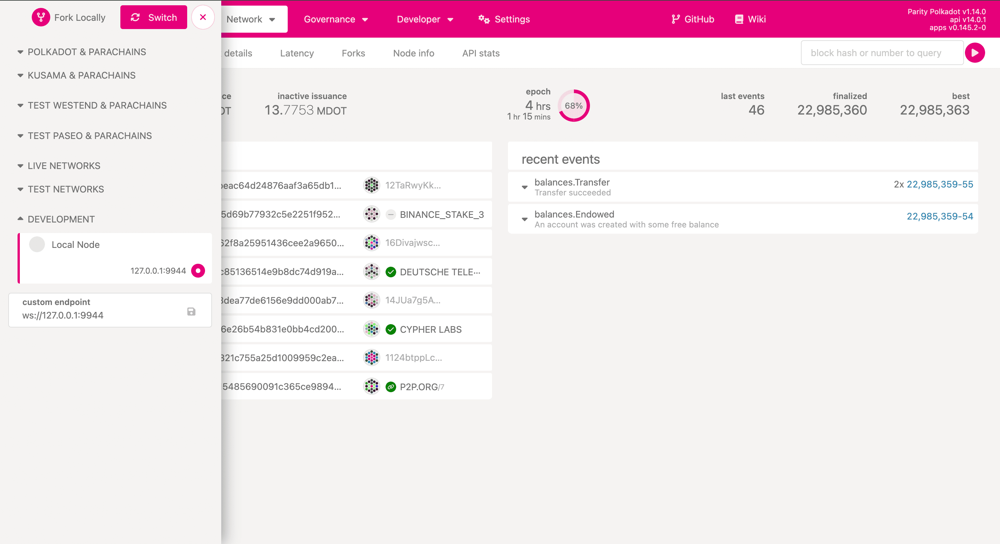
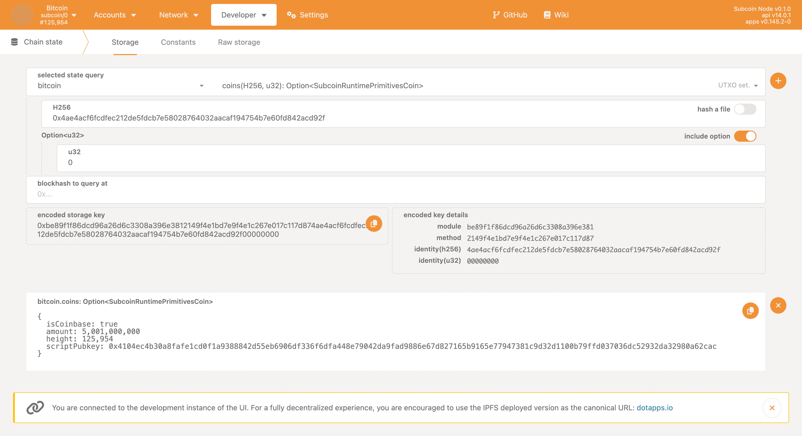

# Interact with Subcoin Chain

The [Polkadot-JS Apps](https://polkadot.js.org/apps) is a versatile UI for engaging with a Substrate based node. You can connect to it to inspect the state of UTXO set, call RPCs, potentially transfer coins in the future.

To connect the Polkadot-JS Apps to your local node, open the sidebar and switch to `Development` > `Local Node (127.0.0.1:9944)`.

## Inspect the State of UTXO Set

Assuming the current best block is #125,954, you may want to examine the UTXO of the coinbase transaction for this block. The Bitcoin transaction ID for this coinbase transaction is `4ae4acf6fcdfec212de5fdcb7e58028764032aacaf194754b7e60fd842acd92f`. You can view it [here](https://www.blockchain.com/explorer/transactions/btc/4ae4acf6fcdfec212de5fdcb7e58028764032aacaf194754b7e60fd842acd92f).

To look up the UTXO:

1. Go to `Developers` > `Chain State`.
2. Paste the txid into the `H256` text box, note that `0x` prefix is necessary.
3. Click the `+` button on the right side to view the details of the coin.

If the node you are connected to is an archive node, you will be able to inspect any UTXO at any height throughout the history.

## Additional Resources

- https://polkadot.js.org/docs/substrate/
- https://docs.substrate.io/reference/command-line-tools/polkadot-apps/
