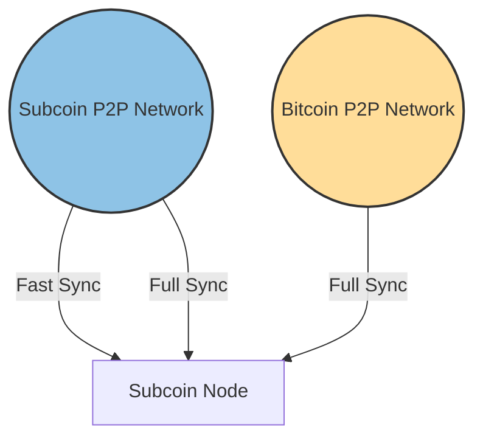

# Set up a Full Node

This guide will show you how to connect to Bitcoin network with Subcoin.

## Overview

### Types of Nodes

- **Archive Node**: An archive node keeps all the past blocks and their states, making it convenient to query the past state of the chain at any point in time. However, an archive node can consume a lot of disk space up to serverl terabytes. Archive nodes are usually used by utilities that need the on-chain information - like block explorers.
- **Full Node**: A full node prunes historical states, all finalized blocks' states older than a configurable number except the genesis block's state will be pruned. This is 256 blocks from the last finalized one by default. A pruned node this way requires much less space than an archive node.
- **Light Node**: TODO

### Sync Strategies

There are two strategies to sync the Bitcoin network for new nodes: _Full Sync_ and _Fast Sync_.

- **Full Sync**: This will download and replay all the blocks from the genesis to the tip directly from the P2P network (either the Subcoin network or directly from the Bitcoin P2P network). This sync strategy is only necessary for establishing the Subcoin bootnodes when the Subcoin P2P network starts as this process is time-consuming and resources-intensive, possibly taking days to complete depending on the performance of your machine. For the regular users, _Fast Sync_ is usually recommended.

- **Fast Sync**: This will download the latest recent Bitcoin state from Subcoin P2P network and then continue with the normal _Full Sync_, with the block history downloaded in the background.

### Subcoin Networkings

<div style={{ textAlign: 'center' }}>



</div>

There are two networking stacks running in parallel in a Subcoin node: one is the network solely consisting of the Subcoin nodes via Substrate networking protocol, the other is the Bitcoin P2P networking instance following the Bitcoin network protocol. _Full Sync_ can be done from either P2P network, while _Fast Sync_ can only be done from Subcoin P2P network.

:::tip

Although it's technically supported to perform a full sync from the Subcoin p2p network, it's not recommended due to the much lower number of Subcoin peers compared with the number of Bitcoin peers.

:::

## Hardware Requirements

Note that the storage usage will grow over time.

- Full Node
  - SSD with 500GiB of space
- Archive Node
  - SSD with 4TiB of space

## Syncing Bitcoin Chain

:::note

Currently, we only support syncing from the Bitcoin mainnet , syncing the other networks are not yet tested.

:::

### Full Sync

Run the following command to sync the Bitcoin blockchain from the Bitcoin P2P network. The `--log subcoin_network=debug` option
will enable debug-level logging to show detailed information about the syncing process. By default, the block will be fully verified.
You can use `--block-verification=none` to skip the block verification. Check out `subcoin run --help` for more options.

```bash
subcoin run -d data --log subcoin_network=debug
```

### Fast Sync

This feature is still a work in progress, refer to https://github.com/subcoin-project/subcoin/blob/subcoin-milestone-3/docs/src/test_fast_sync.md if you are eager to try it out.

<!-- ```bash -->
<!-- subcoin run -d data --blocks-pruning=256 --state-pruning=256 --sync=fast-unsafe --log=info -->
<!-- ``` -->
